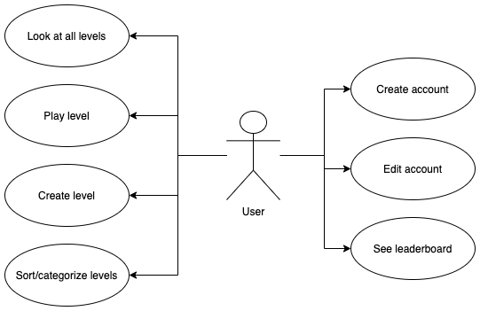

# Deliverable 2 - Requirements

*Group 5 - “CS Play”*   
*Date:* 26 September, 2021

*Group members: Aidan Sullivan, Emma Carlsson, Johnathan Ray, Vincent Machado, Jiasheng Yang, Pengfei Liu*

## 1. Positioning

### 1.1 Problem statement
It is the common phenomenon that most of people think programming is hard and boring to learn. In addition, the lack of engagemment from learning programming affects beginner programmers and non-programmers. These factors make people lose interest in programming.

### 1.2 Product Position Statement
For beginner programmers and non-programmers who are interested in learning programming, CS-Play is an interactive learning platform that teaches programming with puzzles and games, unlike traditional teaching methods in the classroom or video tutorials, which have little to no interactivity. Our product allows users to "write code" immediately by playing games that are more like adventures with guidance and direct results (grades and feedback). The users can also share their work in our community so that they could learn from each other, which is a win for everyone.

### 1.3 Value proposition and customer segment
**Initial value proposition:**  
CS-Play makes learning programming for beginners easy and fun like never before.

**Initial value proposition:**  
Easier and happier for programming.

**Consumer segments:**
* Younger people, 16-25 years old
* Beginner programmers
* People who want to learn something about programming

## 2. Stakeholders
* Developers - These people update and implement features onto the website, game, and other parts of the platform.
* Beginner programmers - Individuals that have just started programming and need a platform that can teach them how to program.
* Non-programmers that want to learn programming - Individuals that have no experience programming but are interested in learning.
* Educators/teachers/expert programmers - Those that will recommand the product to their students, colleagues, etc.
* Websites that teach programming (i.e. Code Academy, Khan Academy) - These are websites that have video tutorials on how to program.
* Classes that teach programming - These are classes that can be found online or at a school that teach individuals how to program in a classroom setting.

## 3. Functional requirements (features)
* Create your own account
* Allow user to play levels created by others
* Provide some measure of user’s success
* Show and tell a user about the varying topics
* Provide assistance for struggling users
* Provide visual feedback for how well someone is doing
* Allow users to create their own levels
* Show a “leaderboard” that indicates a user’s degree of success compared to others

## 4. Non-functional requirements
* _Usability_: User Interface must be simple and maneuverable
* _Usability_: Administrator will be able to view and alter user's account information if requested by the user
* _Reliability_: User login failures should not happen over a rate of 1 per 100 logins
* _Data Integrity_: Database must maintain referential and entity integrity
* _Performance_: The process of submitting code into a game should not exceed 1 second
* _Performance_: Compiling and executing code on the server should not exceed 10 seconds
* _Platform Constraint_: Software should operate on website
* _Compatibility_: Website should be compatible for the following desktop browsers: Chrome, Microsoft Edge, Firefox, Opera
* _Privacy_: User will have username publicly visible by default, but all other user information can be specified as available by the user

## 5. MVP
* The ability to create an account - it is a basic step of almost every games and it can be tested via implementation
* Access to Help documentation -  When players have some troubles in succeeding in the game, she/he can ask for help through Help documentation and this MVP can be tested via     Wizard of Woz.
* The ability to play the level - The programming level of players may be different, so it is important to make sure that players can choose a suitable level to play. It can be   tested by implementation.
* Game background and layout - We can get some feedback if our players are not satisfied with the background and the layout, so it can be tested via Wizard of Woz.
* Show score/measure of success - After playing the game, players have the access to know how they performed, and it can be tested by questionnaire.

## 6. Use cases

### 6.1 Use case diagram

### 6.2 Use case descriptions and interface sketch
**Use case:** Play level  
**Actor:** User   
**Description:** The user can play the level they select    
**Preconditions:** The user has an account and looks at the available levels   
**Postconditions:** The user has played a level   
**Main flow:**
1. The user selects a level
2. The user plays the selected level

**Use case:** Create account  
**Actor:** User     
**Description:** The user must create an account before playing the game  
**Preconditions:** Know the website CS-Play  
**Postconditions:** The user has created an account   
**Main flow:**
1. The user will fill in personal information
2. When a user have created an account, they can play the game

**Use case:** Edit account details  
**Actor:** User 
**Description:** The user may be able to change their account details 
**Preconditions:** User must have created an account and must be signed in  
**Postconditions:** User has updated their account and each update is reflected in the DB 
**Main flow:**
1. The user signs into an account
2. The user views account details and selects to edit details
3. The user changes account details through text boxes
4. The user confirms changes
5. Visual confirmation is shown to the user

**Use case:** Create a level  
**Actor:** User 
**Description:** Any user may be able to create their own level through our level editor  
**Preconditions:** The user must have an account and must be signed in  
**Postconditions:** User creates a level, which then becomes available to the community 
**Main flow:**
1. The user selects "Create a level" in the UI
2. The user is directed to the level editor. If it is their first time creating one, a tutorial is given
3. Once the level is created, the user submits
4. The level becomes available to the public through the community tab

**Use case:** See leaderboard   
**Actor:** User       
**Description:** The user can look at a leaderboard and see how they are ranked compared to other users.  
**Preconditions:** The user has an account and makes their way to the leaderboard.    
**Postconditions:** The user knows where they are on the leaderboard compared to other users.     
**Main flow:** 
1. The user makes their way to the leaderboard.
2. The website shows the user where they are ranked on the leaderboard.
3. The user can look through the rest of the leaderboard to see where other users are ranked.

## 7. User stories
**User story 1:** "As a user, I want to play a level so I can learn programming"  
**Priority:** 1   
**Estimated hours:** 12

**User story 2:** "As a user, I want to look at all the available levels so that I can select one and play"  
**Priority:** 4   
**Estimated hours:** 4

**User story 3:** "As a beginner programmer, I want to learn a programming language systematically so that I can apply it in diverse situations."   
**Priority:** 2     
**Estimated hours:** 5

**User story 4:** "As a beginner programmer, I want to share my levels in the community so that we can learn from each other."    
**Priority:** 4     
**Estimated hours** 4

**User story 5:** "As a player, I want to be able to see help documentation so that I can refer to it when I encounter problems."
**Priority:** 3
**Estimated hours:** 3

**User story 6:** "As a player, I want to be able to see the results so that I can know whether I have made progress or not."
**Priority:** 2
**Estimated hours:** 4

**User story 7:** "As an educator, I want to share this website with my students so they can use it if they are interested in programming.  
**Priority:** 5   
**Estimated hours:** 5

**User story 8:** "As a player, I want to look at the leaderboard so I can see where I am ranked compared to others.  
**Priority:** 2   
**Estimated hours:** 6

## 8. Issue Tracker
[Our Trello Board for Issue Tracking](https://trello.com/b/6tZySP6X/cs-play)
