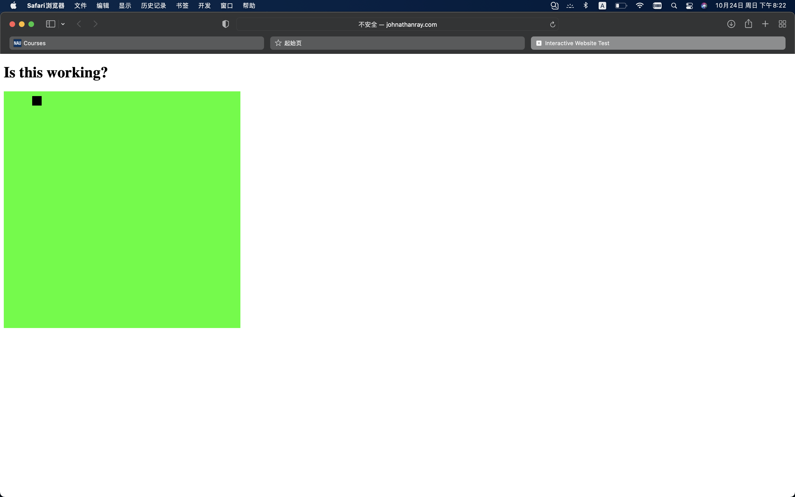

# Deliverable 4 - Implementation 1

*Group 5 - “CS Play”*   
*Date:* 24 October, 2021    
*Group members: Aidan Sullivan, Emma Carlsson, Johnathan Ray, Vincent Machado, Jiasheng Yang, Pengfei Liu*    

## 1. Introduction
CS-Play is an open-source website that teaches somebody who wants to learn  programming by playing games instead of traditional boring classroom teaching. The user will start the coding adventure by an interactive teaching method that is the most efficient way to learn.

CS-Play is still in early development. The website offers more interactive and game elements as the User Interface, which will give CS-Play an edge to emphasize our value proposition so that attract more new programmers and motivate their interest in programming.

Project repo: [https://github.com/jdr479/CS-Play](https://github.com/jdr479/CS-Play)    
Trello: [https://trello.com/b/6tZySP6X/cs-play](https://trello.com/b/6tZySP6X/cs-play)

## 2. Implemented requirements
**Requirement:** As a player, I want to log into my account so that I can use CS-Play.  
**Issue:** [Trello link](https://trello.com/c/cph7gTzv/39-as-a-player-i-want-to-log-into-my-account-so-that-i-can-use-cs-play)    
**Pull Request:** [https://github.com/jdr479/CS-Play/pull/53](https://github.com/jdr479/CS-Play/pull/53)    
**Implemented by:** Emma Carlsson   
**Approved by:** Pengfei Liu    

**Requirement:** As a player, I want to create an account so that I'll be able to use the website.  
**Issue:** [Trello link](https://trello.com/c/gPKmxynQ/40-as-a-player-i-want-to-create-an-account-so-that-ill-be-able-to-use-the-website)   
**Pull Request:** [https://github.com/jdr479/CS-Play/pull/39](https://github.com/jdr479/CS-Play/pull/39)    
**Implemented by:** Emma Carlsson   
**Approved by:** Pengfei Liu    

**Requirement:** As a user, I want to learn the course information so that I know how to program. 
**Issue:** [Trello link](https://trello.com/c/btbAb94k/42-as-a-user-i-want-to-learn-the-course-information-so-that-i-know-how-to-program)   
**Pull Request:** [https://github.com/jdr479/CS-Play/pull/72](https://github.com/jdr479/CS-Play/pull/72)    
**Implemented by:** Jiasheng             
**Approved by:** Pengfei Liu

**Requirement:** As a player, I want to see a user-friendly UI interface so that I may have interest in exploring it.  
**Issue:** [Trello link](https://trello.com/c/3KSeDVr9/43-as-a-player-i-want-to-see-a-user-friendly-ui-interface-so-that-i-may-have-interest-in-exploring-it)    
**Pull Request:** [https://github.com/jdr479/CS-Play/pull/53](https://github.com/jdr479/CS-Play/pull/68)    
**Implemented by:** Pengfei Liu 
**Approved by:** Pengfei Liu   

**Requirement:** As a player, I want to see more entertainment elements so that I will be interested in programming.
**Issue:** [Trello link](https://trello.com/c/gPKmxynQ/40-as-a-player-i-want-to-see-more-entertainment-elements-so-that-i-will-be-interested-in-programming)   
**Pull Request:** [https://github.com/jdr479/CS-Play/pull/72](https://github.com/jdr479/CS-Play/pull/72)   
**Implemented by:** Jiasheng  
**Approved by:** Pengfei Liu

## 3. Tests
For our testing, we decided to use Mocha for any JavaScript code that we need tested.

## 4. Adopted technologies
* VSCode
VSCode is an open-source code editor developed by Microsoft. The software supports syntax highlighting, automatic code completion(also known as IntelliSense), code reconstruction and has built-in command-line tools and git version control system, which is a powerful tool for us to use.

* MySQL
MySQL is a relational database management system developed by MySQL AB company in Sweden, which is a product of Oracle. MySQL is one of the most popular relational database management systems. In terms of web application, MySQL is one of the best RDBMS (relational database management system) application software. CS-Play, as a web production, using mySQL would be a good choice

* SurveyJS
Surveyjs is a complete, fully customizable and extensible survey and form builder. Allow users to use our JavaScript library to integrate the survey / form builder into the user's web application with the required functionality. It has good performance in flexibility, reliability and documentation.

## 5. Learning/training
* HTML, CSS, JavaScript     
Most of the group had previous experience with web development from courses taken in school. To brush up on our skills and learn more about the specific knowledge we needed the website W3Schools and other online tutorials were used.     

* MySQL, PHP      
A database course taken previously and W3Schools provided us with the necessary knowledge for database implementation.    

## 6. Deployment
For web hosting, we used AWS. AWS has a good performance in scalability because it provides us with an easy option to upgrade to a better plan. And we will use Django as our web framework because Django can go well with python and it supports all the libraries that are supported by python programs. Also, Django is a relatively secure web framework. And we will use mySQL as our database management system.  

## 7. Licensing

## 8. Readme File
* [README](https://github.com/jdr479/CS-Play/blob/main/README.md)  
* [CONTRIBUTING](https://github.com/jdr479/CS-Play/blob/main/CONTRIBUTING.md)  
* [CODE_OF_CONDUCT](https://github.com/jdr479/CS-Play/blob/main/CODE_OF-CONDUCT.md)  
* [LICENSE](https://github.com/jdr479/CS-Play/blob/main/LICENSE.md)  

## 9. Look & feel
During our interviews and researches about relevant websites, like Datacamp (https://www.datacamp.com), Leetcode (https://leetcode.com), and other teaching programming website, we decided to use separate the “home page” and “login page”.

Home page:

This is the frame of the home page:

The final home page is still building:

There are some welcome messages and introductions about CS-play; we use the gamepad as our background, emphasizing that learning programming by playing games. Then there is the button “START”. When you click the “START” button, it will go to another page, the login page. This UI design is more like a game.
There is also the course information on the home page.

Login page:

We try to present a simple UI as our login page. Therefore, there are the logo, register link, and login division on the login page. We use “go” as the login button rather than the “login”; it is the game element.

Chosen level page:

We hope the user could choose the different levels, like SuperMary adventure, the block could move around, and each plate represents different levels.

## 10. Lessons learned
Through our initial developments in the project, we have learned more about how to properly implement code. After completing our project, we learned that having an organized project can be just as important as having a functioning one. During our development, we found it difficult to manage our code when we were working between each others' files. As a result, our project didn't work properly all of the time. This issue is something that we will work on in future developments. On top of this, we also learned that communication between developers is important when we sometimes use each others' code and implementations. In general, our group did well with communication when we finished or changed our implementations.

This version of our website is heavily diluted from what we consider to be a final produdct, so we have much to work on in the future. As mentioned before, We will first need to organize our existing code to make it more cohesive. At the moment, our project has a lot of spaghetti code, so it would be useful to have that ironed out before we continue with further developments. We also need to finish implementing the rest of our lower priority user stories, which will be related to users creating and sharing their own levels. Time constraints during our initial implementations led us to leave this implementation for later. We will also be finishing up more levels for the user to interact with, as the one level we created for this implementation was a test.

## 11.Demo

