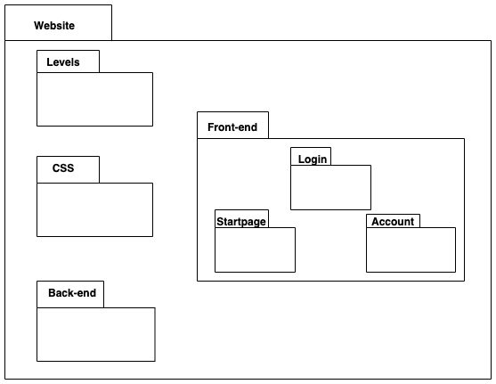
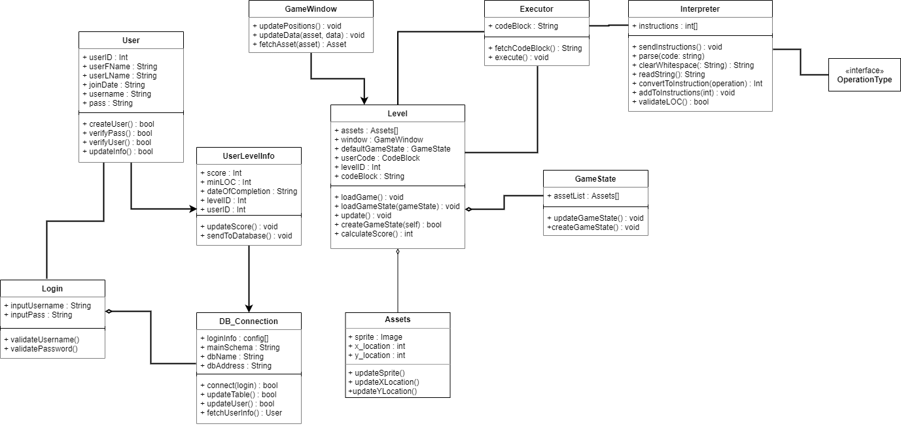
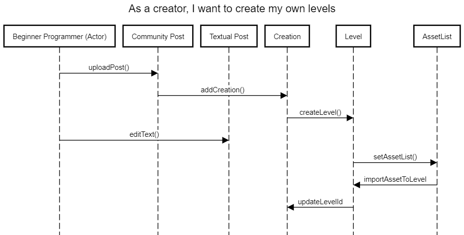

# Deliverable 5 - Design

*Group 5 - “CS Play”*   
*Date:* 7 November, 2021    
*Group members: Aidan Sullivan, Emma Carlsson, Johnathan Ray, Vincent Machado, Jiasheng Yang, Pengfei Liu*    

## 1. Description
For beginner and non-programmers who are interested in learning programming, CS-Play is an interactive platform that teaches programming with puzzles and games. Unlike traditional teaching methods in class and video tutorials, which have little to interactivity. Our product allows users to “write code” immediately by playing games that are more like adventures with guidance and direct results (grades and feedback). The user can share their work in our community so that they could learn from each other, which is a win for everyone.
We want our users to be able to create their own account, play levels created by other users, show and tell a user about the varying topics we want to teach them, provide some measure of success to the user, provide assistance to those who struggle with certain topics, provide visual feedback for how well someone is doing, allow users t ocreate their own levels, and show a "leaderboard" that indicates a user's degree of success compared to others.

## 2. Architecture
   
The website consists of a front-end to handle most of the visible parts, a back-end to handle client-server interaction and the code for the levels/games. The front-end can be divided into categories like startpage, login and account. We designed it like this so that each part would be clearly defined and separated from the rest. This way the developers can focus on one part at a time. 

## 3. Class diagram

## 4. Sequence diagram
    
**Use case**: As a creator, I want to create my own levels

## 5. Design Patterns
Design Pattern 1:(Behavior) Strategy -update X position and Y position from the parent class Position
    

Here is the link for all classes for Design Pattern 1     
[click here](https://github.com/jdr479/CS-Play/blob/main/website/interactive-webpage/Interactivity.js)

Design Pattern 2:(Structural) Flyweight -method to make the background color of the area    

   

Here is the link for the classes for Design Pattern 2   
[click here](https://github.com/jdr479/CS-Play/blob/main/website/interactive-webpage/stylesheet.css)

## 6. Design Principles

